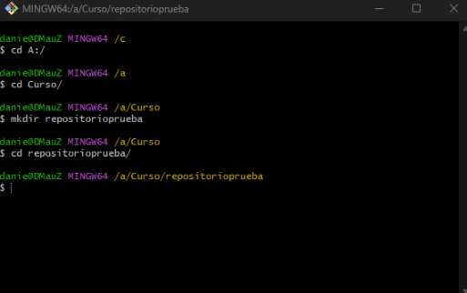
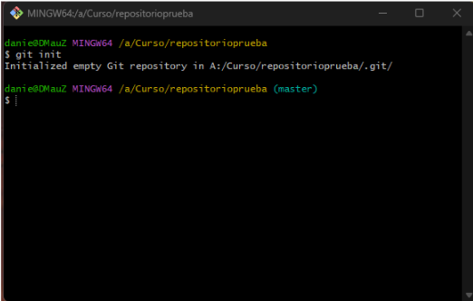
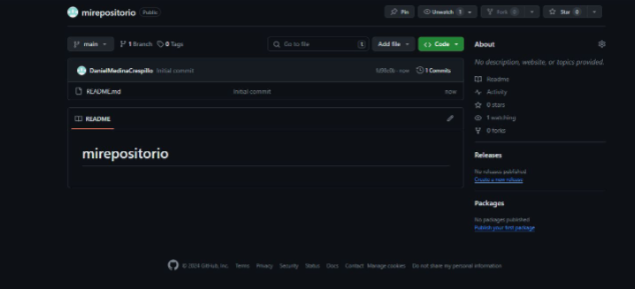
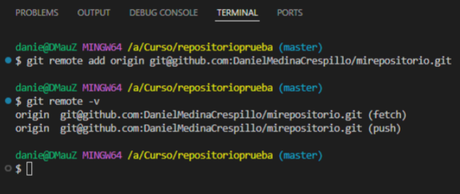
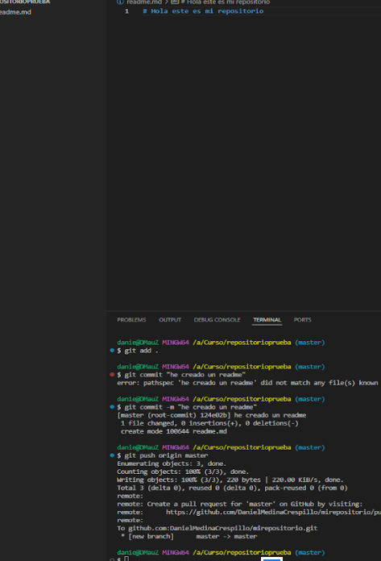
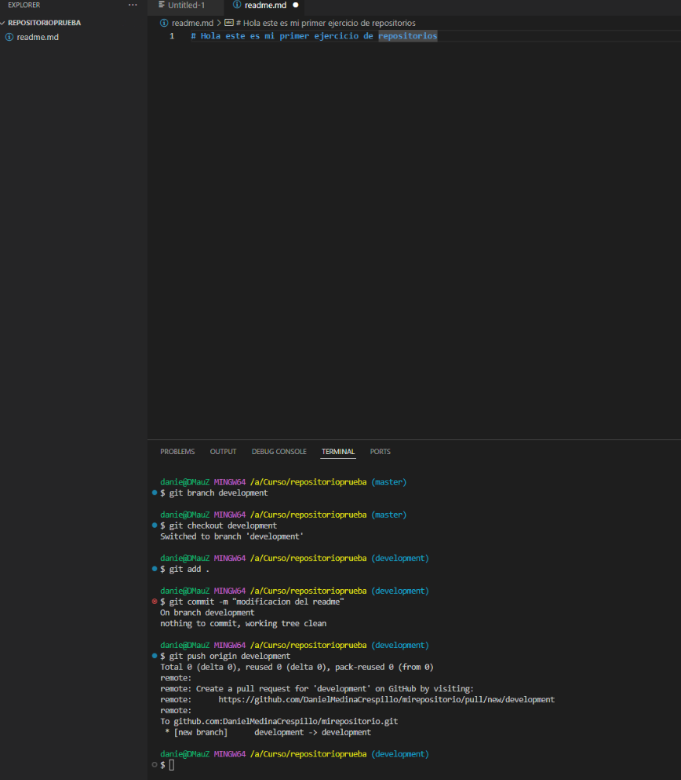
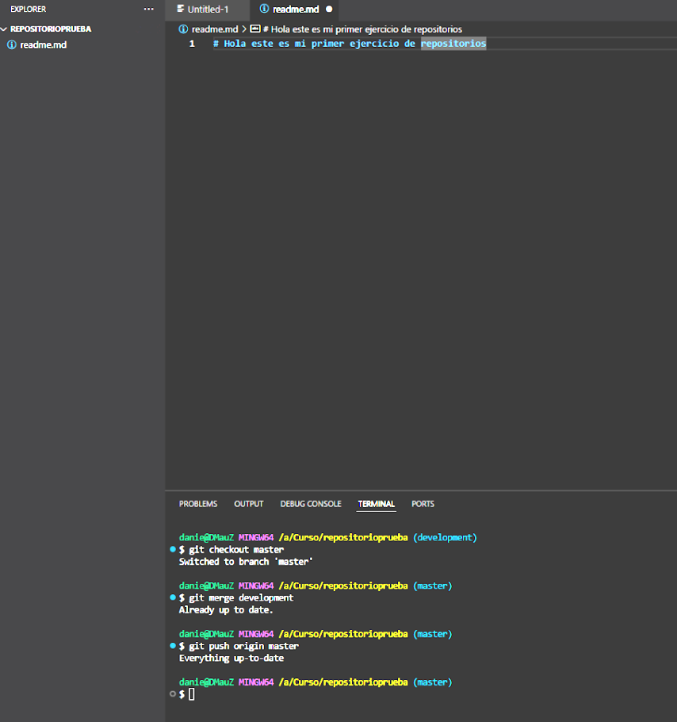

# Laboratorio Modulo 00

## Ejercicio 1

Crear un repositoio en local

## Ejercicio 2

Creo el repositorio en Github

## Ejercicio 3

Creacion de un readme y a continuacion staging, commit y push

## Ejercicio 4

Creacion de rama development, cambio de rama, modificaciones y push

## Ejercicio 5

Hacer un merge

